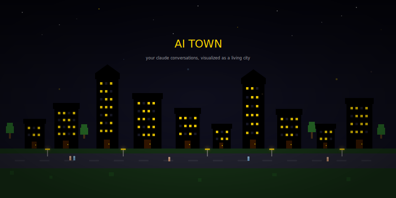

<p align="center">
  
</p>

<h1 align="center">AI Town</h1>

<p align="center">
  <strong>Your Claude conversations, visualized as a living pixel city.</strong><br/>
  Export your Claude chat history, upload it, and watch your conversations turn into buildings — the more you talked, the taller they grow.
</p>

<p align="center">
  <a href="https://aitown-seven.vercel.app">aitown-seven.vercel.app</a>
</p>

---

## What is this?

AI Town takes your exported Claude conversations and turns them into a retro pixel-art city. Each conversation becomes a building — tiny houses for quick chats, towers for your longest deep dives. Peeps wander the streets. Windows flicker at night. It's your AI history, alive.

**How it works:**
1. Export your Claude data as a ZIP
2. Upload it on [aitown-seven.vercel.app](https://aitown-seven.vercel.app)
3. Claim a username, and your town goes live

## Features

- Pixel-art city renderer on HTML canvas with smooth camera controls
- Buildings sized by conversation length (small / medium / large / tower)
- Each building gets a unique color from the conversation UUID
- Flickering windows, wandering peeps, street lamps with glow
- Cinematic auto-pan mode
- Click any building to see conversation stats
- Shareable town URLs (`aitown-seven.vercel.app/yourname`)

## Tech Stack

- **Next.js 16** (App Router)
- **TypeScript**
- **HTML Canvas** for the town renderer
- **Cloudflare R2** for town data storage
- **Tailwind CSS** + retro pixel aesthetic
- **JSZip** for parsing Claude export ZIPs client-side

## Getting Started

```bash
pnpm install
pnpm dev
```

Open [http://localhost:3000](http://localhost:3000).

You'll need a `.env` file with your R2 credentials:

```
R2_ENDPOINT=your_r2_endpoint
R2_ACCESS_KEY_ID=your_access_key
R2_SECRET_ACCESS_KEY=your_secret_key
R2_BUCKET_NAME=your_bucket_name
```

## Project Structure

```
app/
  page.tsx              — Landing page
  upload/page.tsx       — Upload & claim flow
  [username]/page.tsx   — Public town view
  api/towns/            — Town CRUD endpoints
components/
  TownCanvas.tsx        — Canvas renderer component
  BuildingInfoPanel.tsx — Building detail overlay
  UploadZone.tsx        — Drag-and-drop ZIP upload
  UsernameInput.tsx     — Username claim input
  TownStats.tsx         — Town statistics display
  ShareBar.tsx          — Social sharing bar
  ProviderStrip.tsx     — Provider branding strip
  SponsorsSection.tsx   — Sponsors display
  ui/                   — Shared UI primitives (shadcn)
lib/
  canvasRenderer.ts     — Core pixel-art rendering engine
  townLayout.ts         — Grid layout algorithm
  parseClaudeExport.ts  — ZIP parser for Claude exports
  peepAI.ts             — Wandering peep AI logic
  sampleData.ts         — Sample town data for demos
  r2.ts                 — Cloudflare R2 client
  utils.ts              — Shared utilities
```

## License

MIT
